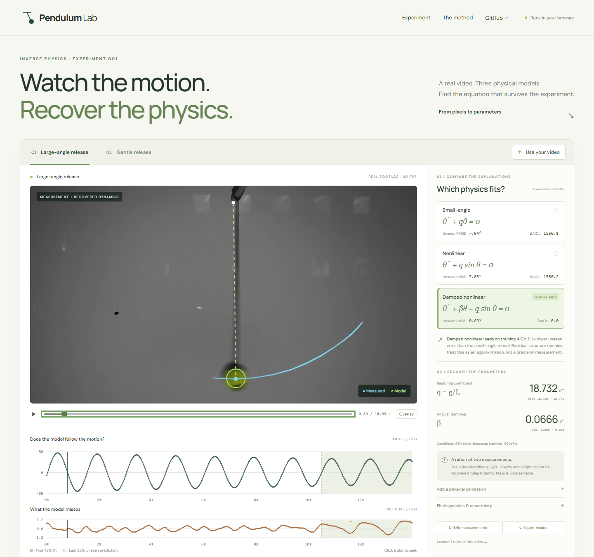

# Pendulum Lab

**Watch the motion. Recover the physics.**

[Open the live experiment](https://s4m256.github.io/pendulum-lab/) · [Methods & limitations](docs/METHODS.md) · [Reproduce the footage](scripts/prepare_examples.py)



A focused inverse-physics workbench: track a pendulum in a real video, fit competing equations, estimate identifiable parameters with uncertainty, and test whether the recovered dynamics predict the rest of the experiment.

The demo opens with two real, attributed laboratory recordings. Uploads stay on your device. There is no AI API, backend, or account requirement.

## Try it

1. Play the experiment. Blue marks measured motion; the green ring is the selected model.
2. Switch between small-angle, nonlinear, and damped nonlinear models. Watch where predictions separate from the real bob.
3. Scrub the video or click a plot. The shaded final quarter was **never used to fit the dynamics**.
4. Upload a fixed-camera pendulum video, select a 2–30 s free-motion interval, mark the pivot and bob, then **Track & fit**. Correct individual points if needed and refit. Export measurements and all model results as JSON.

## What is actually recoverable?

| Quantity | What the app can say |
|---|---|
| Restoring coefficient q | Identified from angles and time; q = g/L for a point-mass pendulum |
| Angular damping β | Estimated in θ̈ + βθ̇ + q sin θ = 0, subject to temporal coverage and noise |
| Initial angle, angular velocity, camera-roll offset | Fitted nuisance parameters, included in the parameter count |
| Gravity g | Only when an independent pivot-to-bob length is supplied |
| Length L | Only when gravity is supplied as an assumption |
| Mass, separate g and L, material friction | **Not independently identifiable from these videos** |

The 95% moving-block bootstrap intervals are **conditional** on tracking, geometry, timestamps, and the chosen model. They do not cover all experimental uncertainty. Correlated residuals remain in both real examples. For extended bodies, q is mgd/I; interpreting it as g/L requires an effective length.

## Measured performance, not synthetic demo data

Default pipeline: fit the first 315 measurements; predict the last 105 without refitting.

| Real IRIS clip | Model | Unseen angular RMSE |
|---|---|---:|
| Large-angle release | Small-angle, undamped | 7.035° |
| Large-angle release | Nonlinear, undamped | 7.028° |
| Large-angle release | Nonlinear + linear damping | **0.626°** |
| Gentle release | Small-angle, undamped | 2.879° |
| Gentle release | Nonlinear, undamped | 2.878° |
| Gentle release | Nonlinear + linear damping | **0.522°** |

This comparison supports including damping in this candidate set. It does **not** isolate the advantage of nonlinearity over a damped linear model, establish the true drag law, or validate gravity independently. The source labels “20°” and “45°” are dataset condition names, not calibrated angle measurements.

## Architecture

A static **TypeScript + Vite** application. Canvas handles measurement and overlays. A Web Worker runs an explicit RK4 integrator, bounded damped Gauss–Newton fitting, a frequency-scan initializer, AICc comparison, and 60 residual-bootstrap refits. No production JavaScript dependencies.

- `src/physics.ts`: independently testable numerical core.
- `src/tracking.ts`: color-connected components, patch correlation fallback, browser video decoding.
- `src/main.ts`: experiment workflow, calibration, export, linked plots and video.
- `public/examples/`: real video excerpts, measured positions, provenance hashes, reproducible fit results.
- `scripts/`: video preparation and example fitting.

## Develop & verify

Node 24+ recommended.

```bash
npm ci
npm run dev
npm test
npm run build
npx playwright install chromium
npm run test:e2e       # with the dev server running
node scripts/fit-examples.ts
```

Tests cover the analytical harmonic solution, integrator convergence, known-parameter recovery (solver-only synthetic unit fixtures), held-out-data isolation, invalid inputs, identifiability/calibration, and regression against both real recordings. Playwright exercises playback, seeking, model changes, calibration, worker refitting, export, an actual video upload through tracking and fitting, manual correction, and mobile layout. GitHub Actions runs tests and deploys the static app to Pages.

## Research & attribution

The design builds on [Tracker](https://opensourcephysics.github.io/tracker/), [trackpy](https://soft-matter.github.io/trackpy/), [Physics-as-Inverse-Graphics](https://arxiv.org/abs/1905.11169), and the [IRIS benchmark](https://github.com/KurbanIntelligenceLab/iris-bench). The contribution here is a compact, inspectable experimental workflow, not a new scientific discovery or a general equation-discovery engine.

Example recordings: **IRIS**, Rasul Khanbayov, Mohamed Rayan Barhdadi, Erchin Serpedin, Hasan Kurban (2026), [dataset](https://huggingface.co/datasets/rasulkhanbayov/IRIS), **CC BY-NC 4.0**. Excerpts are resized, resampled to 30 fps, and muted. Code: **MIT**. See [THIRD_PARTY.md](THIRD_PARTY.md) before reusing the footage commercially.

Built with AI-assisted implementation. The equations, assumptions, validation fixtures, and source data are exposed for inspection and reproduction.
